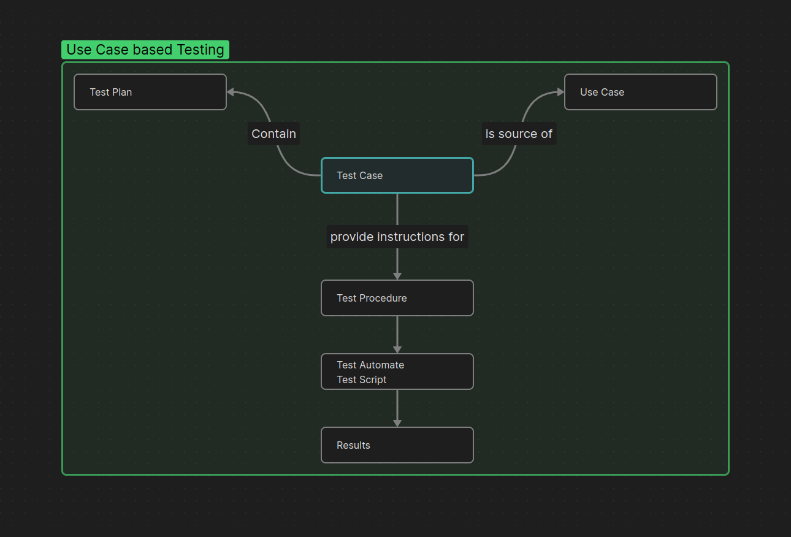

# System Testing
## 1. Use Cases for Testing
use cases used to test functional requirements. The following are some common use cases for testing:

## 2. Use cases based Testing

## 3. Use Case Scenario

## Driving Test Cases from use cases
four steps:
### 1. Identify the use case scenarios: 

### 2. Identify the test cases 
#### 2.1. Parameters fo Test Case
* Test case id
* Scenario / Condition
* Data Value 1
* Data Value 2
* Data Value n
* Expected Result
* Actual Result
* Pass/Fail
* Remarks

### 3. Valid/invalid
### 4. 

## Test Suite
A collection of test cases that are related to each other and are used to test a specific functionality or feature of the system.
## Test Suite Structure
A test suite typically consists of the following components:
* Test suite name
* Test suite description
* Test cases
* Test data
* Test environment
* Test execution plan
## Test Suite Types
There are several types of test suites, including:
* Functional test suite
* Regression test suite

## Test Report Form:
