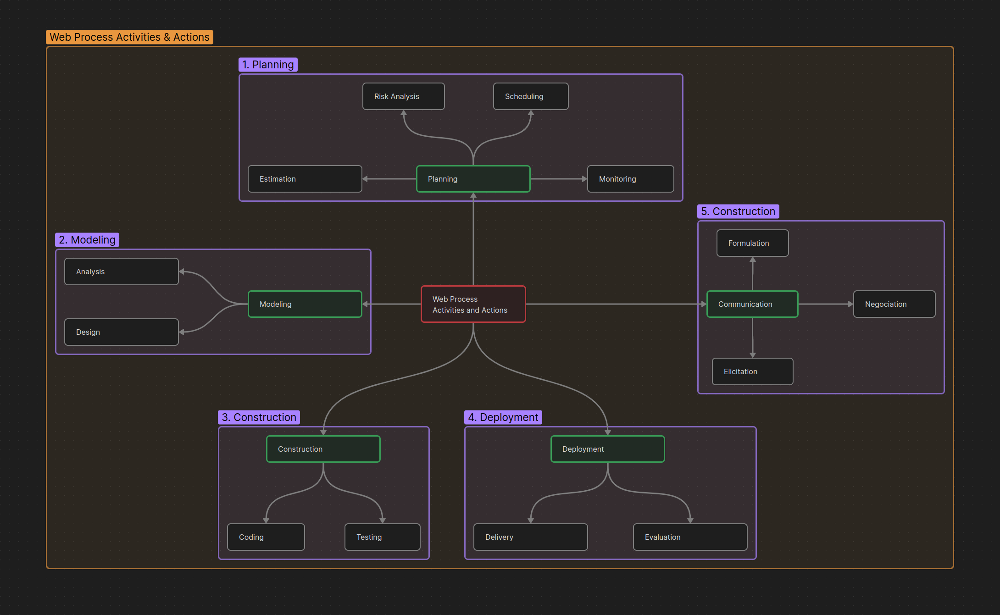

# Web Development Process
The process must be agile and budget must be adoptable and it must also be incremental 
### Why Incremental
1. Requirments evolve over time
2. changes will occur frequently
3. Timelines are short
4. Budget is limited
5. Incremental delivery allows you to manage these changes.
### Why Agile
1. It is a process that is adaptable
2. It is a process that is incremental
3. It is a process that is iterative
4. It is a process that is collaborative
5. It is a process that is flexible
6. It is a process that is customer-centric
7. It is a process that is time-boxed

## Web Process Activities and Actions
1. **Planning**
   * Estimation
   * Risk Analysis
   * Scheduling
   * Monitoring

2. **Modeling**
   * Analysis
   * Design

3. **Construction**
   * Coding
   * Testing

4. **Deployment**
   * Delivery
   * Evaluation

5. **Communication**
   * Formulation
   * Negotiation
   * Elicitation

## Umbrella Activities
Background activities wich occur parallel with main development activities. These are equally important to the success of the project and should be considered explicitly.  
Many umbrella activites can be defined but only four are important for a successfull web engineering project.
### 1. Change Management
in incremental management, managing changins is very important. the project we are developing must be able to accept the changings. while adding new features and changings exixting one. we must care about other parts of project, as it is common problem that while adding new feature or changing one, these may got conflict with others. So we must keep in mind these problems and must test each part that is related to current change.
 How manage changes:  
 1. Identify the change  
 2. Analyze the change  
 3. Plan the change  
 4. Implement the change  
 5. Test the change  
 6. Deploy the change  
 7. Monitor the change  
 8. Review the change  
 9. Document the change  
 10. Communicate the change  

### 2. Quality Essurance
Providing a quality product is very important. We must ensure that the product we are developing is of high quality. We must test each part of the product and ensure that it is working as expected. We must also ensure that the product is maintainable, scalable and flexible. We must also ensure that the product is compatible with other systems and technologies. We must also ensure that the product is secure and reliable. We must also ensure that the product is user-friendly and accessible.

### 3. Risk Management
Risk management is very important in web engineering. We must identify potential risks and threats to the project and take steps to resolve them. We must also identify potential opportunities and take steps to capitalize on them. We must also ensure that the project is aligned with the business goals and objectives. We must also ensure that the project is aligned with the technical goals and objectives. We must also ensure that the project is aligned with the customer needs and expectations.
1. Identify risk
2. Analyze risk
3. Prioritize risk
4. Mitigate risk
5. Monitor risk
6. Review risk
7. Document risk
8. Communicate risk

### 4. Project Management
Project management is very important in web engineering. We must ensure that the project is completed on time, within budget and to the required quality. We must also ensure that the project is aligned with the business goals and objectives. We must also ensure that the project is aligned with the technical goals and objectives. We must also ensure that the project is aligned with the customer needs and expectations. We must also ensure that the project is managed effectively and efficiently. We must also ensure that the project is monitored and controlled.
1. Plan the project
2. Organize the project
3. Staff the project
4. Execute the project
5. Monitor the project
6. Control the project
7. Close the project
8. Review the project
9. Document the project
10. Communicate the project
11. Report the project
12. Evaluate the project
13. Improve the project
14. Learn from the project
15. Apply the lessons learned from the project
16. Document the lessons learned from the project
17. Communicate the lessons learned from the project
18. Review the lessons learned from the project
